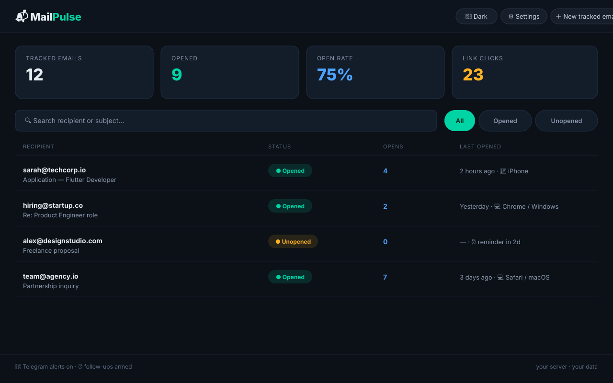
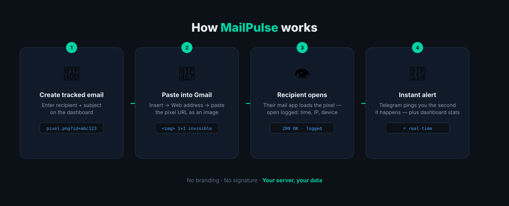

# 📬 MailPulse
### *Know the moment someone opens your email.*

A self-hosted email open tracker: create a tracked email on the dashboard, get a unique tracking-pixel image URL, paste it into your Gmail, and see opens the second they happen. **No branding, no "sent with" signature, no third party — your server, your data.**



## ✨ Features

| | |
|---|---|
| 👁️ **Open tracking** | Invisible 1×1 pixel per email — open count, timestamps, per-open IP & device/app details |
| 🖱️ **Link click tracking** | Add links when creating a tracked email; use the generated `/c/…` URLs as hyperlinks to log clicks |
| 🔔 **Telegram notifications** | Instant alerts for opens, link clicks and follow-up reminders — configure in ⚙️ Settings |
| ⏰ **Follow-up reminders** | Set "remind me in N days if unopened" per email; a daily cron ping sends you a Telegram nudge |
| 📊 **Smart dashboard** | Stats cards, live search, All / Opened / Unopened filters, CSV export |
| 🌙 **Dark mode** | Toggle in the header, remembered per browser |

## 🛠️ How it works



1. You create a tracked email on the dashboard (recipient + subject).
2. You get a unique 1×1 invisible tracking-pixel image URL.
3. In Gmail compose: **Insert photo (🖼️) → Web address (URL) → paste the URL → Insert** (set size to Small).
4. When the recipient opens the mail, their mail app loads the image — the open is logged with timestamp, IP and device info, and your Telegram pings instantly ⚡.

## 🚀 Deploy on PythonAnywhere (free, no credit card)

1. Sign up at [pythonanywhere.com](https://www.pythonanywhere.com) (free Beginner account).
2. Dashboard → **Consoles** → start a **Bash** console, then run:
   ```bash
   git clone https://github.com/nuvishh/MailPulse.git
   cd MailPulse
   mkvirtualenv --python=/usr/bin/python3.11 mailpulse
   pip install -r requirements.txt
   ```
3. Go to the **Web** tab → **Add a new web app** → choose **Flask**, Python 3.11, path `/home/<your-username>/MailPulse`.
4. In the Web tab, open the **WSGI configuration file** and replace its whole contents with this (put your username and a strong password):
   ```python
   import os
   import sys

   path = '/home/<your-username>/MailPulse'
   if path not in sys.path:
       sys.path.insert(0, path)

   os.environ['DASHBOARD_PASSWORD'] = 'choose-a-strong-password'

   from app import app as application
   ```
5. Hit **Reload** on the Web tab.
6. Done — your tracker is live at `https://<your-username>.pythonanywhere.com`. Dashboard login with the password you set above.

> Free web apps need an occasional renewal — PythonAnywhere emails you, just log in and extend it.

<details>
<summary><b>Alternative: Deploy on Render (free)</b></summary>

1. Push this folder to a GitHub repo.
2. Go to [render.com](https://render.com) → **New + → Web Service** → connect the repo — or use the `render.yaml` in this repo via **New + → Blueprint**.
3. Render auto-generates a `DASHBOARD_PASSWORD` (see `render.yaml`) — find it under **Environment** after deploy.
4. Deploy. Your public URL will look like `https://mail-tracker-xxxx.onrender.com`.

Note: Render's free tier sleeps after inactivity (cold starts ~30s) and its disk is ephemeral — the SQLite DB is wiped on redeploys.
</details>

## 📲 Telegram notifications

1. Chat with **@BotFather** on Telegram → `/newbot` → copy the bot token.
2. Start a chat with your new bot (tap **Start**).
3. Open `https://api.telegram.org/bot<token>/getUpdates`, find `"chat":{"id":…}` — that's your chat ID.
4. In MailPulse go to **⚙️ Settings**, paste both, save, and hit **Send test message**.

You can also set `TELEGRAM_BOT_TOKEN` / `TELEGRAM_CHAT_ID` as environment variables instead of using the settings page.

## ⏰ Follow-up reminders

Free hosting can't run background jobs, so an external cron pings the app:

1. When creating a tracked email, set **Follow-up reminder** to e.g. `3` days.
2. Create a free account at [cron-job.org](https://cron-job.org) (no card) and add a **daily** job hitting:
   ```
   https://<your-url>/api/check-followups?key=<url-encoded-dashboard-password>
   ```
   ⚠️ If your password contains `#`, `&` or `+`, URL-encode it (`#` → `%23`) — otherwise the key never reaches the server and the endpoint returns 403 silently. The Settings page shows the ready-to-copy encoded URL.
3. If a tracked email is still unopened after N days, you get a Telegram reminder — once per email.

## ⚙️ Environment variables

| Variable | Purpose | Default |
|---|---|---|
| `DASHBOARD_PASSWORD` | Password for the dashboard | _(none = open)_ |
| `TELEGRAM_BOT_TOKEN` | Telegram bot token (or set in ⚙️ Settings) | _(none)_ |
| `TELEGRAM_CHAT_ID` | Telegram chat ID (or set in ⚙️ Settings) | _(none)_ |
| `PORT` | Port to listen on | `5000` |
| `DB_PATH` | SQLite file location | `./tracker.db` |

## 💻 Run locally

```bash
pip install -r requirements.txt
DASHBOARD_PASSWORD=secret python app.py
# open http://localhost:5000  (pixel URLs will use localhost — for real
# tracking you need the public URL)
```

## 🧰 Tech stack

Flask · SQLite · Jinja2 · vanilla JS · Telegram Bot API — no build step, no framework bloat. One `app.py`, runs anywhere Python runs.

## ⚠️ Notes & limitations

- **Image blocking:** if the recipient's mail app blocks images, the open won't register. Reliable in most cases, but not 100%.
- **Gmail image proxy:** Gmail loads images through its own proxy — the open is still recorded, but the IP you see will be Google's, not the recipient's. Timestamps remain accurate.
- **Apple Mail Privacy Protection** may pre-load images and cause false opens.
- **SQLite on ephemeral disks** (e.g. Render free): the DB survives restarts but is wiped on redeploys. PythonAnywhere's disk persists.

---

*Built because Mailtrack's free plan stamps "Sent with Mailtrack" on every mail — unprofessional on a job application. This stamps nothing.*
